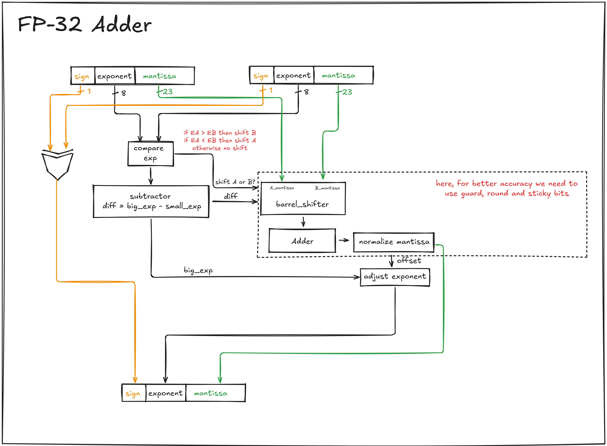

big picture : align exponent (compare, shift), add mantissa, then adjust exponent several steps like this.

also, for higher accuracy, we need to take care of extra guard, round, and sticky bits, needed across 3 blocks.

  

